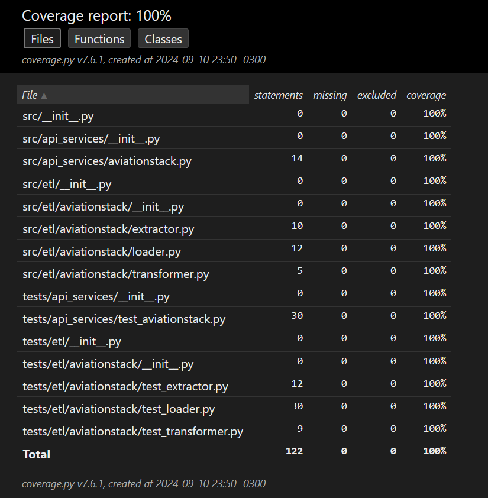

# Sobre

Esse repositório tem como objetivo realizar um ETL simples da [AviationStack API](https://aviationstack.com/). Além disso, o repositório também realiza uma análise dos dados processados, [contidas no notebook analysis_etl_aviationstack.ipynb](./notebooks/analysis_etl_aviationstack.ipynb), fornecendo insights e visualizações úteis.

## Principais tecnologias usadas:

- Python: Linguagem de programação principal para o desenvolvimento do ETL e da análise de dados.
- Jupyter Notebook: Ambiente interativo para criação e compartilhamento de notebooks com código e visualizações.
- PostgreSQL: Sistema de gerenciamento de banco de dados relacional utilizado para armazenar e consultar dados.
- psycopg2: Biblioteca para conectar e interagir com o banco de dados PostgreSQL a partir do Python.
- Pandas: Biblioteca para manipulação e análise de dados.
- GitHub Actions: Configurado para executar a lintagem do código automaticamente e rodar os testes sempre que houver um push para o repositório.
- unittest: Framework para realização de testes unitários, assegurando a funcionalidade do código.
- coverage: Ferramenta para medir a cobertura dos testes, ajudando a identificar partes do código não testadas.
- folium: Biblioteca para visualização de dados geoespaciais em mapas.
- matplotlib: Biblioteca para criação de gráficos e visualizações estáticas em Python

# Pré-requisitos

É necessário ter instalado o docker junto com o docker compose na máquina. Para instalar o docker compose siga as [instruções.](https://docs.docker.com/compose/install/)

Também é necessário uma chave de API que você deverá obter registrando-se no serviço [AviationStack](https://aviationstack.com/documentation).

# Como rodar o ETL?

Primeiro copie o arquivo .env.example e cole com o nome .env e preencha as variáveis de ambiente, como por exemplo: 

```
AVIATIONSTACK_ACCESS_KEY=sua_chave_de_api_do_aviationstack
POSTGRES_USER=postgres
POSTGRES_PASSWORD=postgres
POSTGRES_HOST=postgres
POSTGRES_DB=elt_aviationstack
POSTGRES_PORT=5432
```

depois rode o comando:

```
$ docker compose -f docker-compose.yml --env-file .env up -d --build
```

ou se tiver usando um sistema UNIX basta rodar o bash script com:

```
$ bash up.etl.v2.sh
```

Observação: o processo de ETL pode levar alguns minutos para ser concluído. Como não há um feedback visual implementado, pode ser necessário aguardar um pouco para verificar se os registros foram inseridos no banco de dados. Ao executar o script up.etl.v2.sh no bash, um sistema de log está disponível, o que pode ser mais eficiente para monitorar a conclusão da execução do ETL.`

# Como rodar a análise?

Após rodar o ETL, pode ser necessário subir o container do banco de dados, onde os dados foram salvos, com o comando:

```
$ docker compose -f docker-compose.yml --env-file .env up -d postgres --build --remove-orphans
```

Crie um ambiente virtual seguindo as [instruções](https://docs.python.org/3/library/venv.html) e ative-o. Em seguida, instale as dependências do projeto com o comando:

```
$ pip install -r requirements.txt
```

Ao abrir o [notebook de análise](./notebooks/analysis_etl_aviationstack.ipynb), selecione o kernel correspondente ao caminho do ambiente virtual criado. E então rode todas as células do jupyter notebook.

# Como rodar os testes?

Para rodar todos os testes contidos na pasta tests, use o comando:

```
$ python -m unittest discover -s tests -p "test_*.py"
```

Para rodar os testes e verificar a cobertura de código, use o comando:

```
$ coverage run -m unittest discover -s tests -p "test_*.py"
```

# Observação

- A análise presente no [notebook de análise](./notebooks/analysis_etl_aviationstack.ipynb) refere-se à execução do ETL realizada em 09/09/2024.

- Algumas bibliotecas de lint foram utilizadas para assegurar que o código segue o padrão [PEP8.](https://peps.python.org/pep-0008/)
Como por exemplo: pylint, flake8, black, isort, mypy.

- O comando `docker compose` funciona apenas a partir da versão 2 do Docker CLI. Se você estiver usando a versão 1, é necessário substituir por `docker-compose`.

- Cobertura de código de 100% usando o Coverage report

- Na própria [documentação da biblioteca psycopg2](https://www.psycopg.org/docs/extras.html), é recomendado o uso da função `execute_batch` para lidar com um grande volume de dados.

- Não há comentários no código, pois sua implementação é clara e autoexplicativa.

